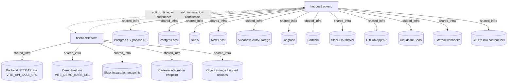

# Startup plan: Hobbes platform + backend

## Prerequisites — required infra and version requirements

### Runtimes and tooling
- **Python 3.11** for `hobbesBackend`
- **uv** for the backend’s non-Docker Python/test workflow
- **Docker + Docker Compose** for the backend’s primary documented local startup path
- **Node.js 20** recommended for `hobbesPlatform`
- **npm** for the platform frontend

### Required shared infrastructure / external services
#### Core for local app startup
- **PostgreSQL / Supabase Postgres**
  - Backend requires:
    - `SUPABASE_DB_HOST`
    - `SUPABASE_DB_PORT`
    - `SUPABASE_DB_NAME`
    - `SUPABASE_DB_USER`
    - `SUPABASE_DB_PASSWORD`
- **Redis**
  - Backend supports/configures Redis via:
    - `REDIS_HOST`
    - `REDIS_PORT`
    - `REDIS_ENABLED`
  - There is evidence of an optional local Redis compose file: `backend/docker-compose.redis.yml`
- **Backend HTTP API**
  - Platform requires the backend API via `VITE_API_BASE_URL`
  - Default local value is `http://localhost:8000`

#### Required/likely-required external integrations depending on features used
- **Supabase Auth/Storage**
  - `SUPABASE_URL`
  - `SUPABASE_ANON_KEY`
  - `SUPABASE_SERVICE_KEY`
- **Gemini / Google AI**
  - `GEMINI_API_KEY`
- **Langfuse**
  - `LANGFUSE_BASE_URL`
  - `LANGFUSE_PUBLIC_KEY`
  - `LANGFUSE_SECRET_KEY`
  - `LANGFUSE_ENABLED`
- **Cartesia**
  - `CARTESIA_API_KEY`
  - optional `CARTESIA_BASE_URL`
- **Slack OAuth/API**
  - `SLACK_CLIENT_ID`
  - `SLACK_CLIENT_SECRET`
  - `SLACK_SIGNING_SECRET`
  - also callback settings such as `SLACK_REDIRECT_URI`
- **GitHub App / GitHub API**
  - `GITHUB_APP_*`
  - optional/used `GITHUB_API_BASE_URL`
- **Cloudflare custom hostname API**
  - `CLOUDFLARE_SAAS_*`
- **Object storage / signed upload support**
  - platform uses backend upload/storage endpoints
- **Demo host**
  - platform uses `VITE_DEMO_BASE_URL`, defaulting to `https://demo.hihobbes.com`

### Optional observability / app services
- **PostHog** for frontend analytics
- **Sentry** for frontend error reporting
- **LiveKit / Deepgram / ElevenLabs / Browserbase / Exa / SendGrid** appear in backend env files as optional or feature-specific integrations

---

## Env vars — grouped by repo, marked required/optional

### `hobbesBackend` (`/repos/hobbesBackend`)

#### Required
- `GEMINI_API_KEY`
- `SUPABASE_DB_HOST`
- `SUPABASE_DB_PORT`
- `SUPABASE_DB_NAME`
- `SUPABASE_DB_USER`
- `SUPABASE_DB_PASSWORD`
- `SUPABASE_URL`
- `SUPABASE_SERVICE_KEY`

#### Optional / feature-dependent
- `DATABASE_TYPE`
- `SUPABASE_ANON_KEY`
- `SUPABASE_STORAGE_BUCKET`
- `PLATFORM_MEMORIES_BUCKET`
- `PLATFORM_MEMORIES_PREFIX`
- `PLATFORM_MEMORIES_ORG_ID`
- `PLATFORM_MEMORIES_DIR`
- `REDIS_HOST`
- `REDIS_PORT`
- `REDIS_ENABLED`
- `GOOGLE_APPLICATION_CREDENTIALS`
- `ANTHROPIC_API_KEY`
- `SENDGRID_API_KEY`
- `EXA_API_KEY`
- `LANGFUSE_PUBLIC_KEY`
- `LANGFUSE_SECRET_KEY`
- `LANGFUSE_BASE_URL`
- `LANGFUSE_ENABLED`
- `LIVEKIT_URL`
- `LIVEKIT_API_KEY`
- `LIVEKIT_API_SECRET`
- `DEEPGRAM_API_KEY`
- `ELEVEN_LABS_API_KEY`
- `BROWSERBASE_API_KEY`
- `BROWSERBASE_PROJECT_ID`
- `CARTESIA_API_KEY`
- `CARTESIA_BASE_URL`
- `SLACK_CLIENT_ID`
- `SLACK_CLIENT_SECRET`
- `SLACK_SIGNING_SECRET`
- `SLACK_REDIRECT_URI`
- `FRONTEND_URL`
- `PUBLIC_ASSET_BASE_URL`
- `EVALS_API_BASE_URL`
- `GITHUB_API_BASE_URL`
- `GITHUB_APP_*`
- `CLOUDFLARE_SAAS_*`

### `hobbesPlatform` (`/repos/hobbesPlatform`)

#### Required for normal local full-stack dev
- `VITE_API_BASE_URL`

#### Optional
- `VITE_API_TIMEOUT`
- `VITE_USE_API_BACKEND`
- `VITE_DEMO_BASE_URL`
- `VITE_PUBLIC_POSTHOG_KEY`
- `VITE_SENTRY_DSN`
- `VITE_SENTRY_DEBUG`
- `VITE_APP_VERSION`
- `SENTRY_AUTH_TOKEN`
- `SENTRY_ORG`
- `SENTRY_PROJECT`
- `VITE_WEBSOCKET_URL` *(mentioned in CI, repo usage unclear)*

---

## Steps — one numbered step per ordered group from the topo sort, parallel commands grouped

1. **Provision/configure infrastructure and third-party dependencies from topo group 1**
   
   Set up the infra and external endpoints before starting either repo:
   - Postgres/Supabase database
   - Redis if enabled
   - Supabase Auth/Storage
   - Langfuse if used
   - Cartesia if used
   - Slack app credentials if testing Slack flows
   - GitHub App/API credentials if testing GitHub-related flows
   - Cloudflare SaaS credentials if testing custom hostname flows
   - Demo host value for frontend (`VITE_DEMO_BASE_URL`) if needed
   - Backend API base URL target for frontend (`VITE_API_BASE_URL`)
   - Any webhook receiver configuration needed under backend `/api/webhooks`
   - Any object storage backing used by upload flows
   
   Recommended preparation commands:
   ```bash
   # Backend
   cd /repos/hobbesBackend
   cp backend/env.example .env
   # edit .env and fill required values

   # Platform
   cd /repos/hobbesPlatform
   cp .env.example .env
   # edit .env and set at least VITE_API_BASE_URL=http://localhost:8000
   ```

2. **Start repo group 2 in parallel: backend and platform**
   
   These are in the same topo group. For practical full-stack usage, start the backend first or alongside the frontend; the matcher reported a soft runtime cycle, but the stronger grounded evidence is that the frontend consumes the backend API.

   **Terminal A — backend**
   ```bash
   cd /repos/hobbesBackend/backend
   docker compose up --build
   ```
   Verify:
   ```bash
   curl http://localhost:8000/health
   ```

   **Terminal B — platform**
   ```bash
   cd /repos/hobbesPlatform
   npm install
   npm run dev
   ```

   Optional backend test workflow:
   ```bash
   cd /repos/hobbesBackend/backend
   uv sync --extra test
   uv run --extra test pytest tests -m "not integration"
   ```

   Optional platform checks:
   ```bash
   cd /repos/hobbesPlatform
   npm run build
   npm run lint
   ```

---

## Dependency graph — Mermaid diagram of nodes and typed edges



---

## Caveats — ambiguous edges, cycle-breaking decisions, low-confidence matches, anything to verify

- **Soft runtime cycle between repos is low confidence and likely misleading for startup order.**
  - Matcher found:
    - `hobbesBackend -> hobbesPlatform` with confidence `0.6`
    - `hobbesPlatform -> hobbesBackend` with confidence `0.6`
  - Grounded repo evidence more strongly supports:
6    - **platform consumes backend** via many `/api/*` routes on `http://localhost:8000`
    - backend does reference frontend-ish URLs such as `FRONTEND_URL`, but that does **not** mean backend must wait for frontend to start
  - I did **not** change the provided topo grouping, but in the step wording I recommend starting backend first or alongside the platform because that is operationally safer.

- **No cycle breaks were provided** in the dependency graph.

- **Matcher ambiguity:** `PUBLIC_ASSET_BASE_URL` in backend could not be resolved to a known repo.
  - This likely points to a static asset host/CDN or another service outside these two repos.
  - Verify whether local dev needs it populated.

- **Backend startup path is most clearly Docker-based.**
  - The documented local startup is `docker compose up --build` from `backend/`.
  - A non-Docker local app run command was not explicitly grounded, so none is invented here.

- **Backend debug compose override may need verification.**
  - Startup-plan evidence mentions `docker-compose.override.yml`, but presence/usage should be checked locally.

- **Frontend requires backend availability for normal operation.**
  - Even though topo group 2 lists both repos together, the platform will be only partially usable until the backend on `VITE_API_BASE_URL` is running.

- **Redis appears optional/conditional.**
  - It is referenced via env vars and a compose file, but exact feature gating should be verified for your local use case.

- **Several backend integrations are feature-specific, not necessarily required for first boot.**
  - Examples: Slack, Cartesia, GitHub App, Cloudflare, Langfuse, LiveKit, Deepgram, ElevenLabs, Browserbase, SendGrid, Exa.
  - If you only need core local startup, prioritize DB/Supabase/backend/frontend vars first.

- **Backend boundaries report notes many additional routers not exhaustively enumerated.**
  - So the exposed API surface is broader than the summarized list.

- **Frontend `VITE_WEBSOCKET_URL` is ambiguous.**
  - It appears in CI but code usage was not clearly grounded in the repo boundary report.

- **Demo host is external to these repos.**
  - `VITE_DEMO_BASE_URL` defaults to `https://demo.hihobbes.com`; local replacement may not exist in this repo set.

- **Object storage is an external dependency path, not a separate repo here.**
  - Platform upload flows depend on backend-generated signed uploads/storage handling; ensure corresponding backend/Supabase storage config exists.